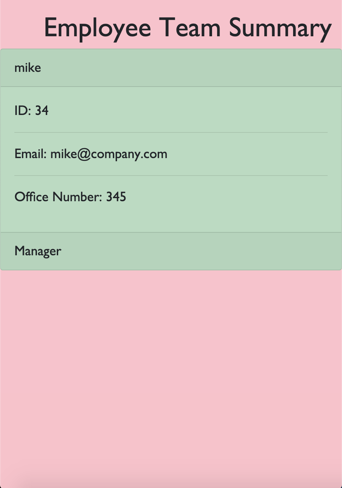

# Template Engine
A Node CLI that takes in information about employees and generates an HTML webpage that displays summaries for each person.

## Prerequisites
Dependencies: Jest and Inquirer

### Notes
Test files provided by course instructor.

## Deployed Site

https://marktmcgraw.github.io/template-engine/.

### Demo

